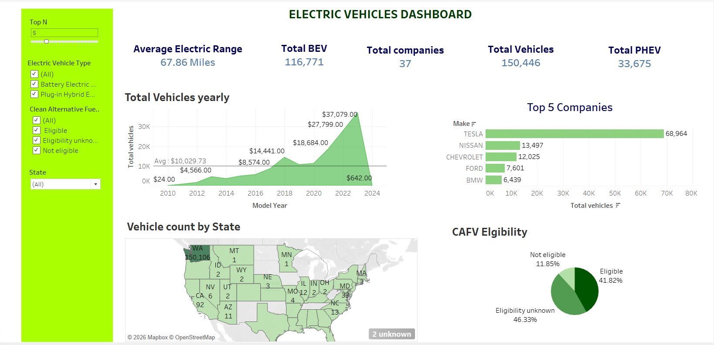

# Electric Vehicle Dashboard

An interactive Tableau dashboard analyzing Electric Vehicle (EV) data to uncover trends in adoption, range, and distribution.

## Files

| File | Description |
|------|-------------|
| `EV.twb` | Tableau workbook containing the dashboard |
| `Electric_vehicles_data.xlsx` | Source dataset used for analysis |
| `EV-Dashboard.png` | Dashboard preview image |

## Dashboard Overview

This dashboard provides visual insights into:
- Electric vehicle adoption trends over time
- Distribution of EV types (BEV vs PHEV)
- Geographic spread of EV registrations
- Popular EV makes and models
- Electric range analysis

## Tools Used

- **Tableau** — Data visualization and dashboard creation
- **Microsoft Excel** — Data source

## Preview

